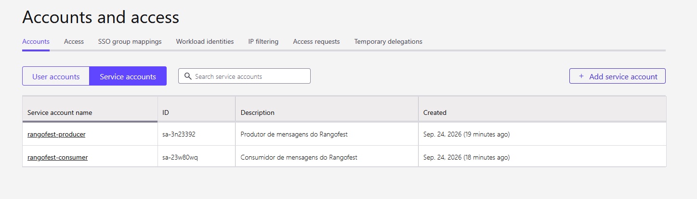
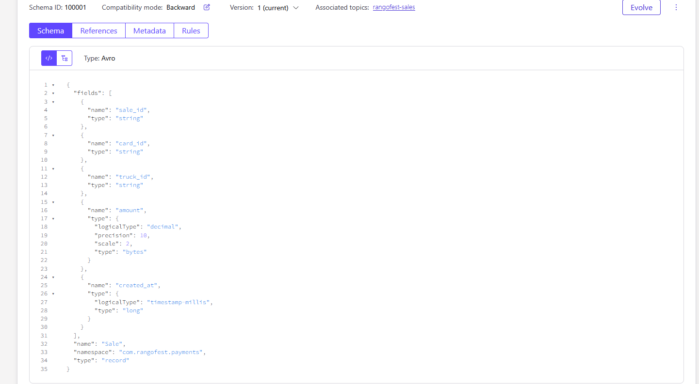
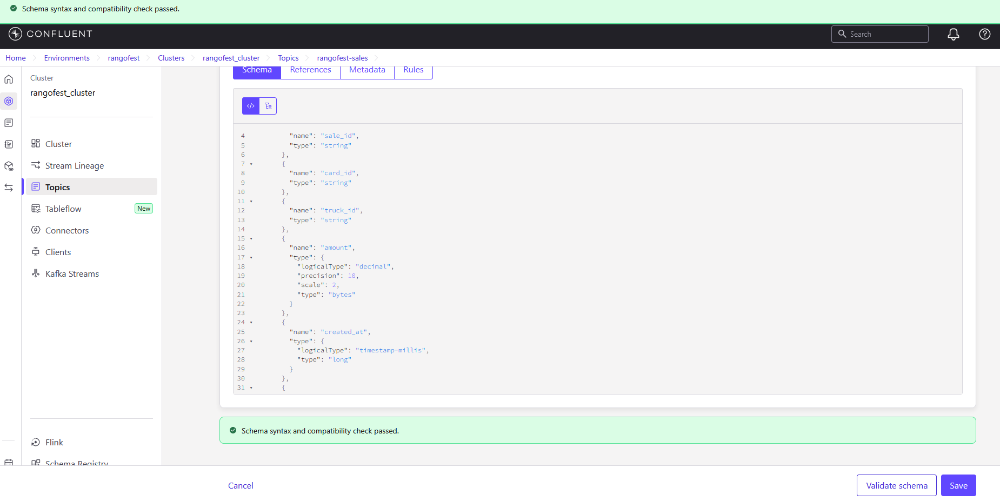
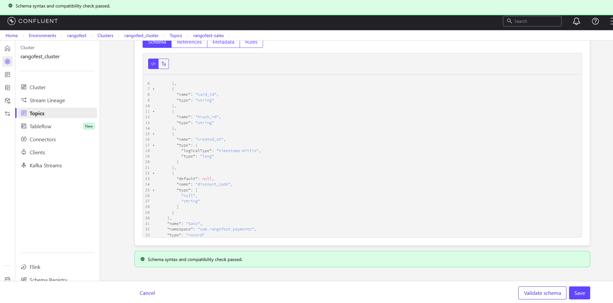
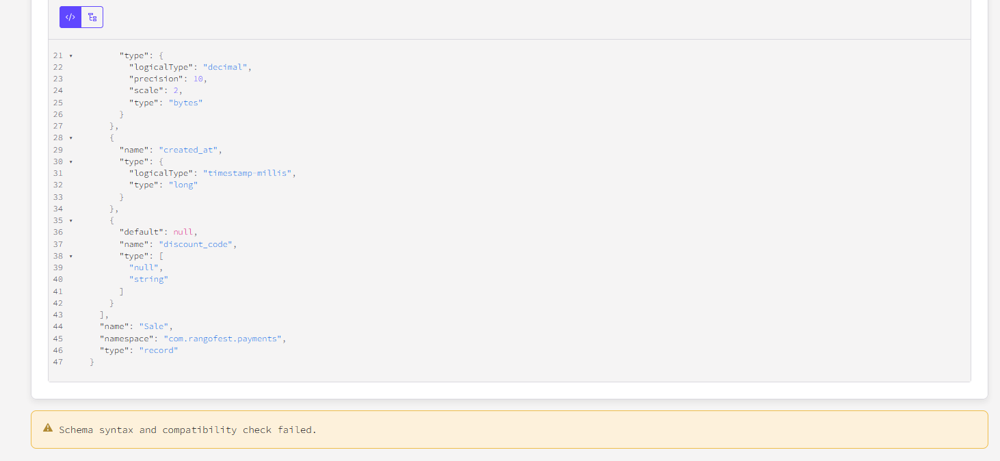
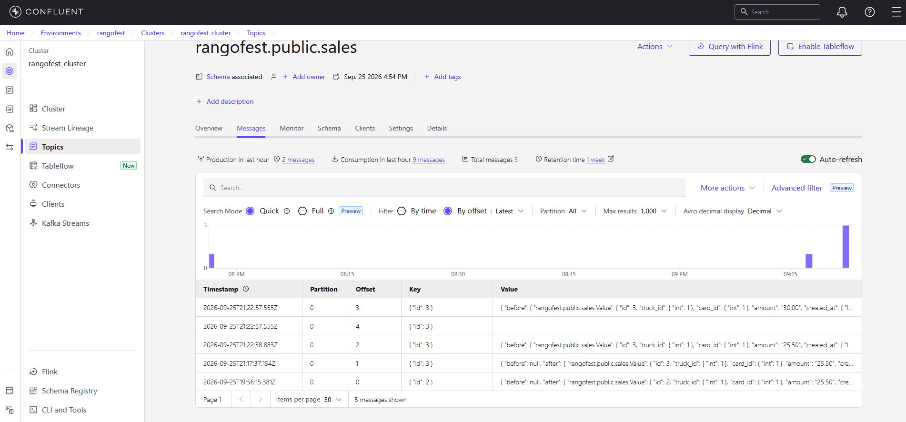
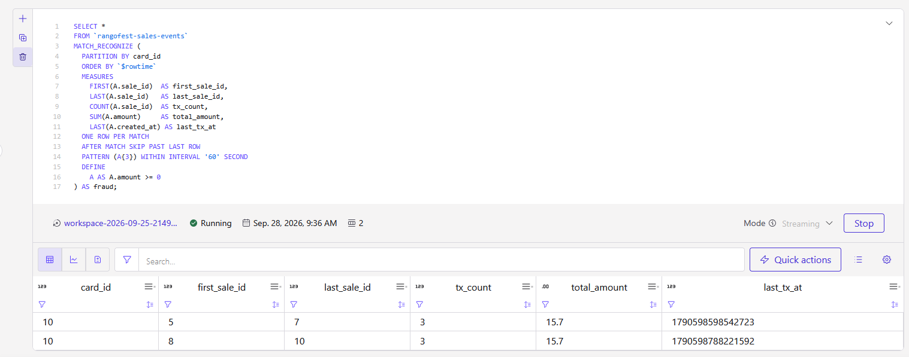

# Pipeline de Pagamentos em Tempo Real — Rango Fest

Pipeline de streaming ponta a ponta: do Postgres ao alerta de fraude, no Confluent Cloud.

## O caso
Rango Fest é um festival fictício de food trucks. A regra detectada: 3 ou mais
transações no mesmo cartão em menos de 60 segundos — padrão de card testing.

## Como subir do zero
1. Crie um projeto no Neon (Postgres) e habilite Logical Replication em Settings.
2. Rode os scripts de `sql/` na ordem numerada, no SQL Editor do Neon.
3. Copie `.env.example` para `.env` e preencha com valores reais.
4. Rode `bash setup.sh` e siga as instruções impressas (ele intercala
   comandos de CLI com passos manuais no console do Confluent Cloud).
5. Registre `schemas/sale.avsc` no Schema Registry.
6. Crie o conector com `connectors/postgres-cdc-source-v2.json` como referência.
7. Rode `sql/06_flink_fraud_rule.sql` no SQL Workspace do Flink.

## Como derrubar tudo
Rode `bash teardown.sh` e siga as instruções — ele lista os recursos que
cobram por hora e orienta a exclusão de cada um.

## Camada 1 — Fundação
Environment `rangofest`, cluster Basic `rangofest-cluster` (AWS, sa-east-1),
duas service accounts com ACLs de menor privilégio:
`rangofest-producer` (WRITE + CREATE) e `rangofest-consumer` (READ).



## Camada 2 — Contrato (Schema Registry)
Schema `Sale` em Avro (ver `schemas/sale.avsc`), compatibilidade `BACKWARD`.
Testado nos dois sentidos: campo opcional com default é aceito; campo
obrigatório sem default é rejeitado.






## Camada 3 — Ingestão (CDC)
Conector Postgres CDC Source V2 (Debezium), capturando `sales`, `cards` e
`trucks`. Tópicos gerados: `rangofest.public.sales`, `rangofest.public.cards`,
`rangofest.public.trucks`. `REPLICA IDENTITY FULL` na tabela `sales` para
capturar o "antes" de UPDATE/DELETE.



### Problemas reais encontrados e resolvidos
- Confluent Cloud exige forma de pagamento cadastrada mesmo no trial — resolvido
  com o código promocional `CONFLUENTDEV1`.
- Erro de conexão por host incompleto (faltava o segmento de região) ao copiar
  a connection string do Neon.
- `Permission denied for database` ao tentar criar a publicação automaticamente —
  resolvido criando a publicação manualmente com o usuário dono das tabelas
  (ver `sql/05_publication.sql`) e desativando o auto-create no conector.
- Adicionar tabelas novas à captura não dispara um novo snapshot automaticamente
  — foi necessário recriar o conector para capturar `cards` e `trucks`.
- Falta de permissão `CREATE` no producer impedia a criação de tópicos novos
  pelo conector — resolvido com uma ACL adicional de `CREATE` prefixada.
- Snapshots repetidos (por reconfigurações sucessivas do conector) geraram
  linhas duplicadas nos tópicos — resolvido apagando os tópicos e reiniciando
  o conector, sem precisar recriá-lo do zero.

## Camada 4 — Processamento (Flink SQL)
Os tópicos do CDC chegam como changelog (insert/update/delete), e
`MATCH_RECOGNIZE` só aceita streams append-only. Por isso, o processamento
tem duas etapas:

1. `TO_CHANGELOG(...) WHERE op = 'INSERT'` — filtra só vendas novas.
2. `MATCH_RECOGNIZE` — 3 vendas no mesmo `card_id` em 60 segundos vira um
   alerta, gravado no tópico `rangofest-fraud-alerts`.



Mensagens do tópico `rangofest-fraud-alerts` (ver `evidencias/08-camada4-topico-alertas.txt`):
```
{ "card_id": 11, "first_sale_id": 11, "last_sale_id": 13, "tx_count": 3, "total_amount": "3.00" }
{ "card_id": 10, "first_sale_id": 8,  "last_sale_id": 10, "tx_count": 3, "total_amount": "15.70" }
{ "card_id": 10, "first_sale_id": 5,  "last_sale_id": 7,  "tx_count": 3, "total_amount": "15.70" }
```

O enriquecimento com dados de cartão e truck (JOIN) foi validado por consulta
manual durante o desenvolvimento; materializá-lo como stream contínuo fica
como próxima evolução.

## Camada 5 — Operação
- Custo do período: ver `evidencias/09-camada5-billing-cost.png`
  (saída de `confluent billing cost list`).
- Acesso: as mesmas ACLs da Camada 1, reconfirmadas — nenhuma identidade tem
  mais permissão do que precisa.
- O conector CDC é a peça que mais custa (US$0,80/h) e continua cobrando
  mesmo pausado — só a exclusão interrompe a cobrança.

## Segurança
- Nenhuma senha ou chave está neste repositório. Use `.env.example` como
  modelo e mantenha o `.env` real fora do Git.

## Ideias para evoluir
- Materializar o enriquecimento (venda + cartão + truck) como stream contínuo.
- Segunda regra de fraude, com outra janela/critério.
- Dead-letter queue para eventos com defeito no conector.
- Materializar os tópicos como tabelas Iceberg via Tableflow.
